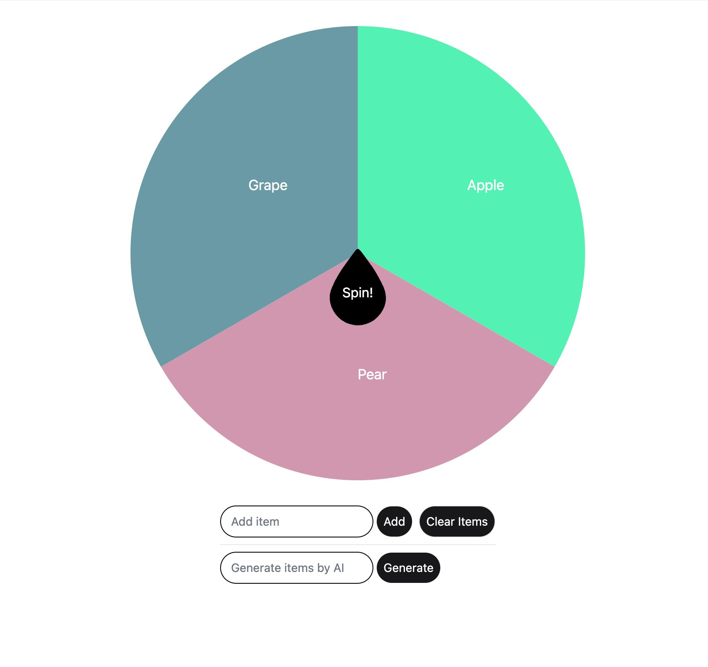

# Smart Wheel - Phoenix LiveView with Svelte Roulette

## Description

This project is a Phoenix LiveView application with a frontend built using Svelte. The standout feature is a custom roulette wheel component, which is a direct copy from the [svelte-custom-roulette](https://github.com/jor-col/svelte-custom-roulette) repository.

## Features

- Phoenix LiveView for backend and real-time updates.
- Svelte for a modern and reactive frontend.
- Custom roulette wheel component.

## Installation

To start your Phoenix server:

- Run `mix setup` to install and setup dependencies
- Start Phoenix endpoint with `mix phx.server` or inside IEx with `iex -S mix phx.server`

Now you can visit [`localhost:4000`](http://localhost:4000) from your browser.

## Usage

- Navigate to the homepage to see the roulette wheel in action.
- Interact with the wheel to experience the Svelte-powered frontend.

## Credits

The custom roulette wheel component is sourced from [svelte-custom-roulette](https://github.com/jor-col/svelte-custom-roulette) by [jor-col](https://github.com/jor-col).
